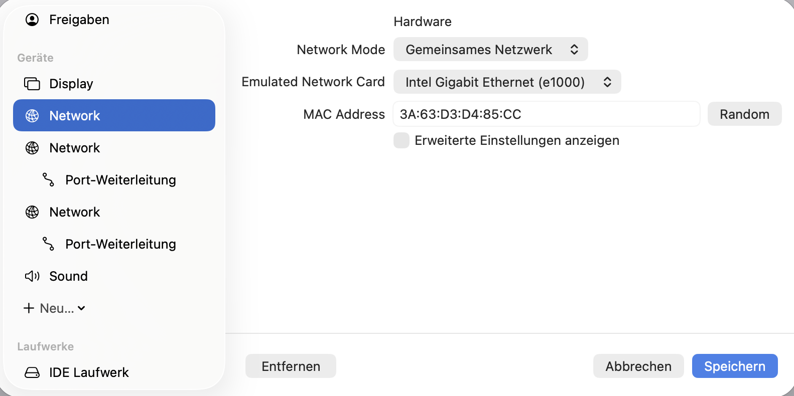
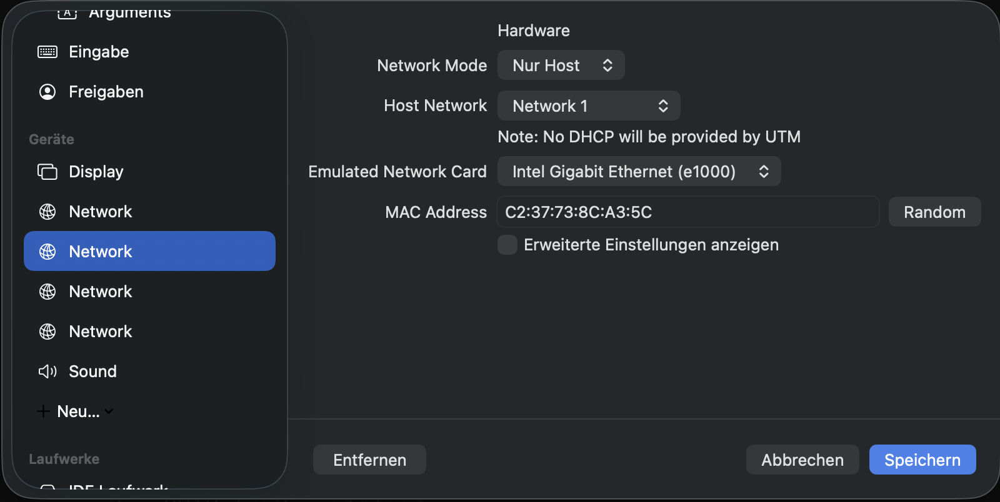
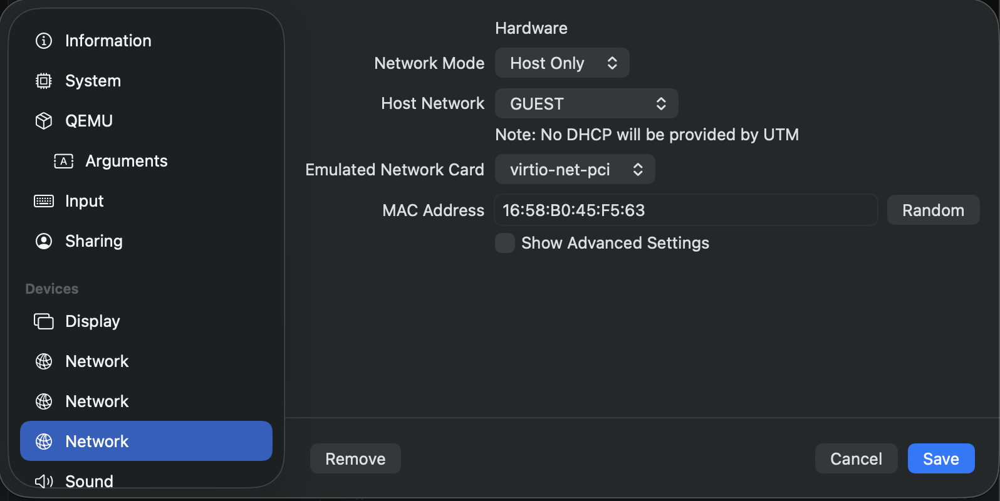
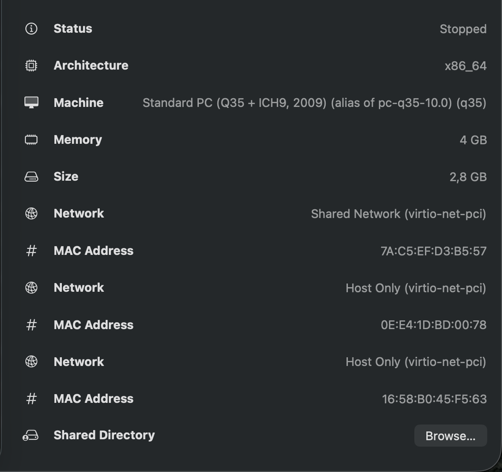
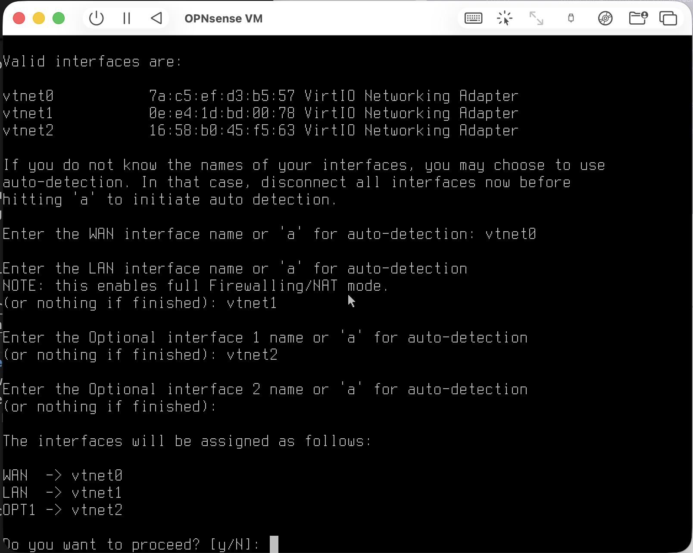
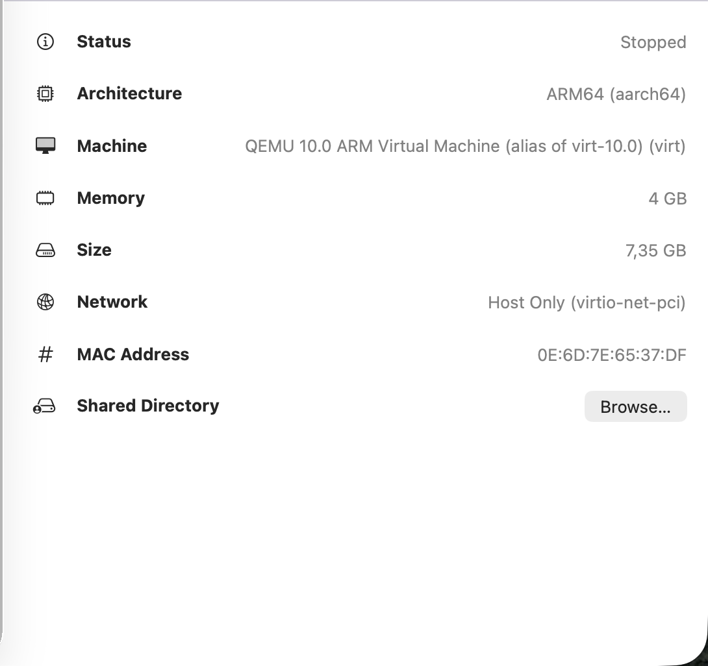
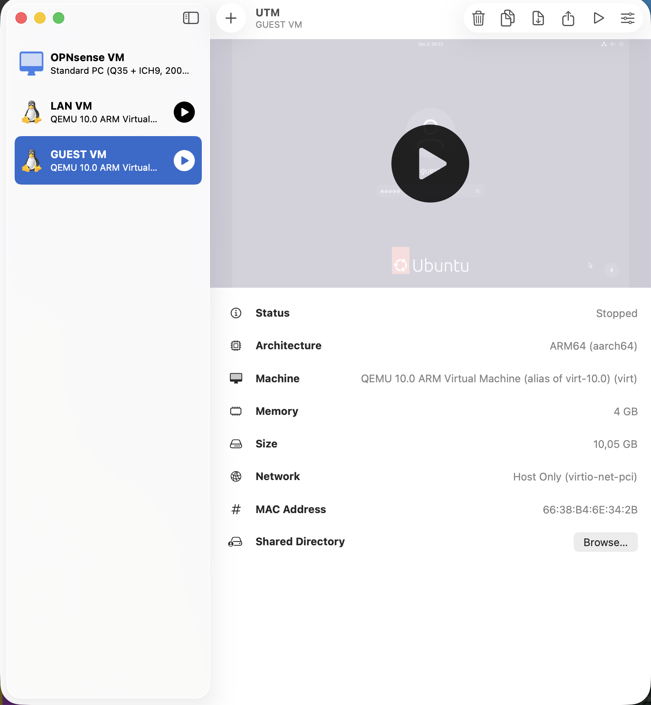

## 1. UTM Environment Preparation

This lab uses UTM on macOS to build a small virtual network environment with one firewall VM and two client VMs. UTM gives me all the virtual switches, NAT services, and interface mappings I need without touching the host system.
Because OPNsense requires x86_64, the firewall VM has to run in full emulation.
The client VMs run normally as ARM64 Linux machines.

## 2. Virtual Networks

I created three separate virtual networks in UTM. These will later match how the real multi-segment setup works.

### 1. WAN Network

  - Mode: Shared Network (NAT)
  - Emulated Network Card: virtio-net-pci
  - Purpose: Gives OPNsense Internet access through macOS
  - UTM automatically provides DHCP here
  - Used only by the firewall VM

### 2. LAN Network

  - Mode: Isolated Network
  - Emulated Network Card: virtio-net-pci
  - Used by the trusted LAN client VM
  - Connected to OPNsense as the main internal network

 

### 3. GUEST Network

  - Mode: Isolated Network
Used by the guest client VM
Connected to OPNsense as a restricted network

LAN and GUEST are completely isolated inside UTM.
Any communication between them will later go through OPNsense only.

## 3. OPNsense VM Setup in UTM

### Hardware Configuration

  - Architecture: x86_64 (emulated)
  - Memory: 2–4 GB (depending on host resources)
  - CPU: 2 cores recommended
  - Disk: 16–32 GB
  - Boot ISO: OPNsense installation image

### Network Interfaces (in order)

  - vtnet0 → WAN (Shared Network)
  - vtnet1 → LAN (Isolated Network)
  - vtnet2 → GUEST (Isolated Network)

The order matters so that OPNsense assigns the interfaces correctly.

## 4. Client VMs

I prepared two small Linux VMs for testing later.

### LAN Client
  
  - Architecture: ARM64 (aarch64)
  - Network: LAN isolated network
  - Receives its IP through DHCP from OPNsense

### GUEST Client
  
  - Architecture: ARM64 (aarch64)
  - Network: GUEST isolated network
  - Also receives an IP via DHCP from OPNsense

These VMs will help verify segmentation, firewall rules, routing, and Internet access.

## 5. Summary

At this point, the UTM environment is ready:

  - Three isolated virtual networks
  - One emulated OPNsense firewall VM connected to all networks
  - Two client VMs connected to LAN and GUEST
  - A clean foundation for everything that comes next
    
This setup acts like a small two-segment network with a firewall in between.