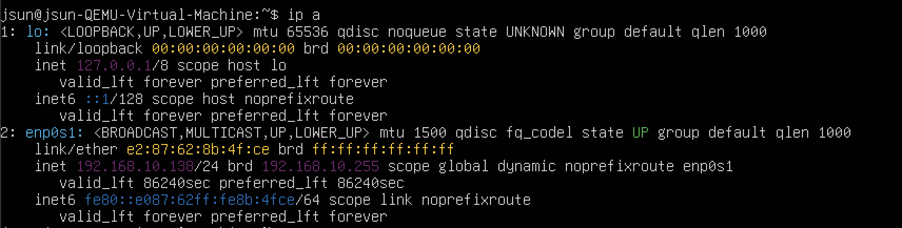
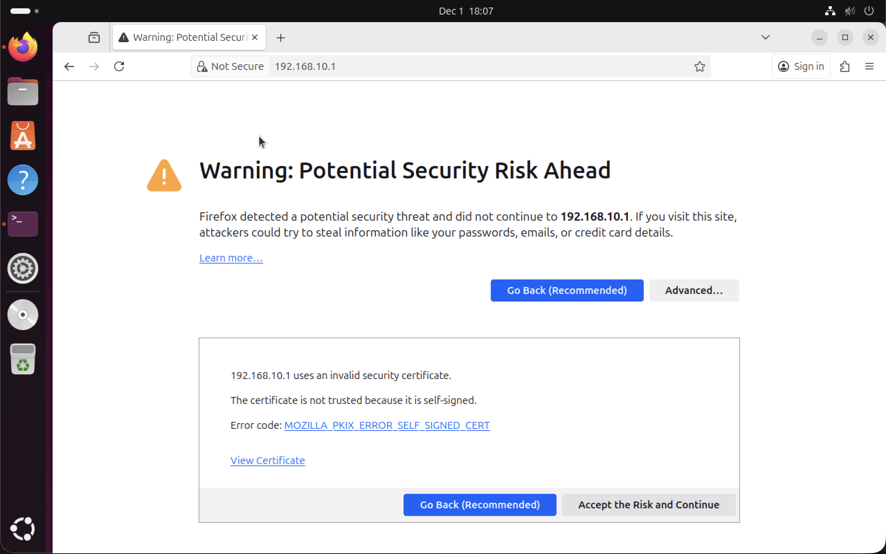
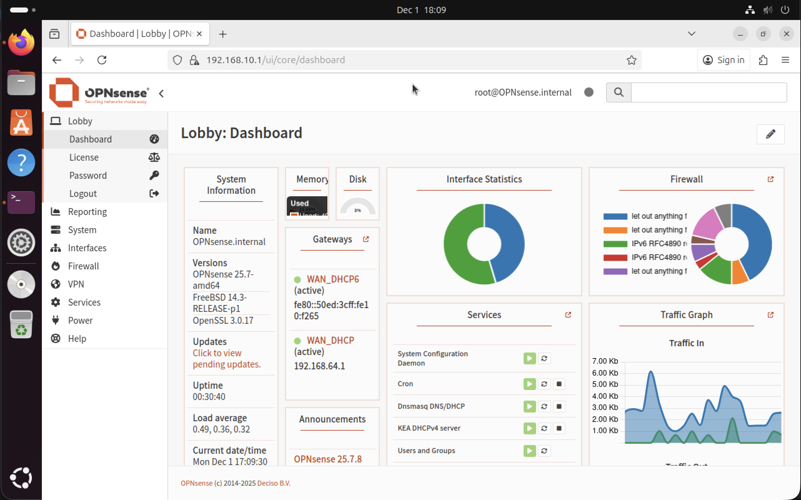

## Client VM Setup

Two client virtual machines are used in this lab environment:

  - One connected to the LAN network
  - One connected to the GUEST network

Both clients are based on Ubuntu Desktop, which provides a graphical interface and a preinstalled web browser for accessing the OPNsense WebGUI.

## 1. Creating the Client VMs in UTM

Create two separate VMs in UTM:

### LAN Client VM
  - Connected to LAN-Net
  - Ubuntu Desktop (ARM64) installation

### GUEST Client VM
  - Connected to GUEST-Net
  - Ubuntu Desktop (ARM64) installation

Each VM requires:

  - 2 CPU cores
  - 2048 - 4096 MB RAM
  - 16 -32 GB disk
  - Network interface attached to the corresponding isolated UTM network

No additional configuration is required during installation.

## 2. Network Connectivity

After installation boot each VM and verify that it is connected to the correct UTM network.

### LAN Client

Open a terminal inside the LAN VM and run:

    ip a

Expected result (example):
  
  - Interface (usually enp0s1)
  - IP address in the range 192.168.10.x (or empty, until DHCP is configured later)

At this stage, the LAN client may not receive an IP address yet, because DHCP will be configured in the firewall after WebGUI access.
A static temporary IP may be assigned if needed:

    sudo ip addr add 192.168.10.20/24 dev enp0s1

### GUEST Client

The same procedure applies.

Expected address (once DHCP is configured later): 192.168.20.x

## 3. Accessing the OPNsense WebGUI from the LAN Client

Once the LAN client is connected to the correct network and has an IP address in the LAN subnet, open the web browser (Firefox is included by default in Ubuntu Desktop) and navigate to:

  https://192.168.10.1

A certificate warning will appear because OPNsense uses a self-signed certificate.
Continue to the page.

Login with:

  - User: root
  - Password: opnsense

The OPNsense setup wizard will appear and can be completed as needed.

## 4. Preparing for DHCP Configuration

The next step of the project requires DHCP services to be enabled on both the LAN and GUEST interfaces.
At this point, the client VMs only need:
  
  - Network connectivity
  - Browser access to the firewall
  - Ability to reach the WebGUI

Full client-side automation (DHCP, DNS) will be configured in the next chapter.

