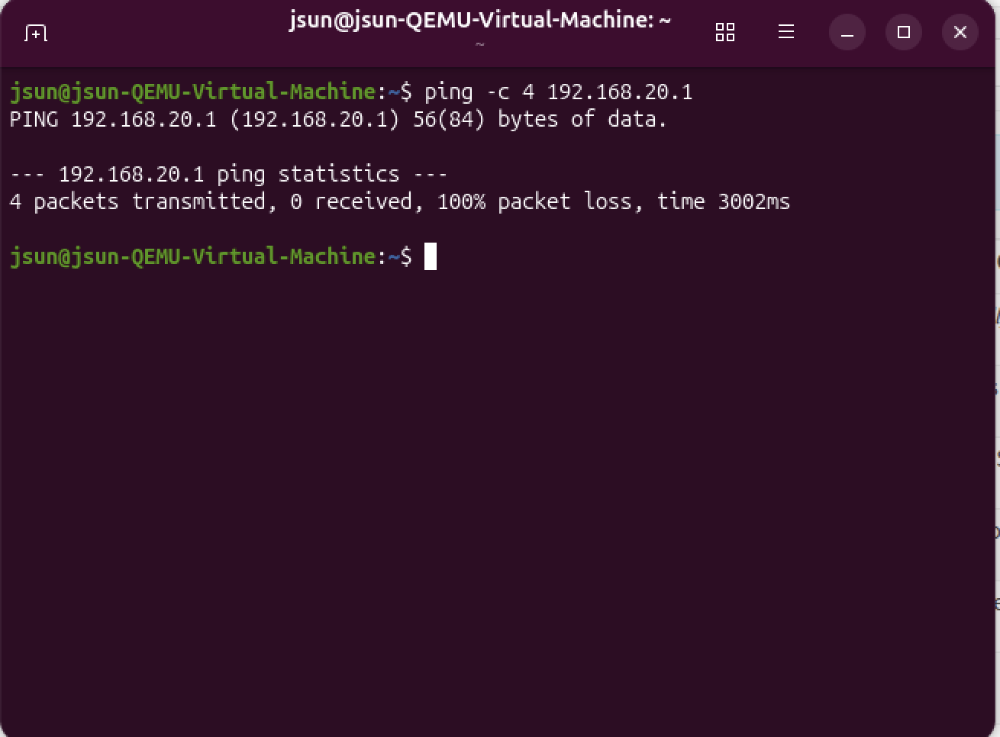
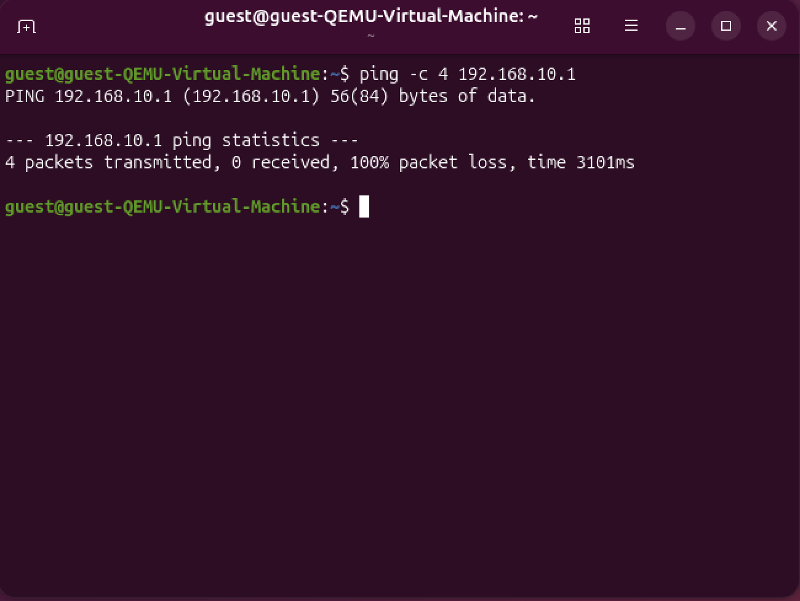
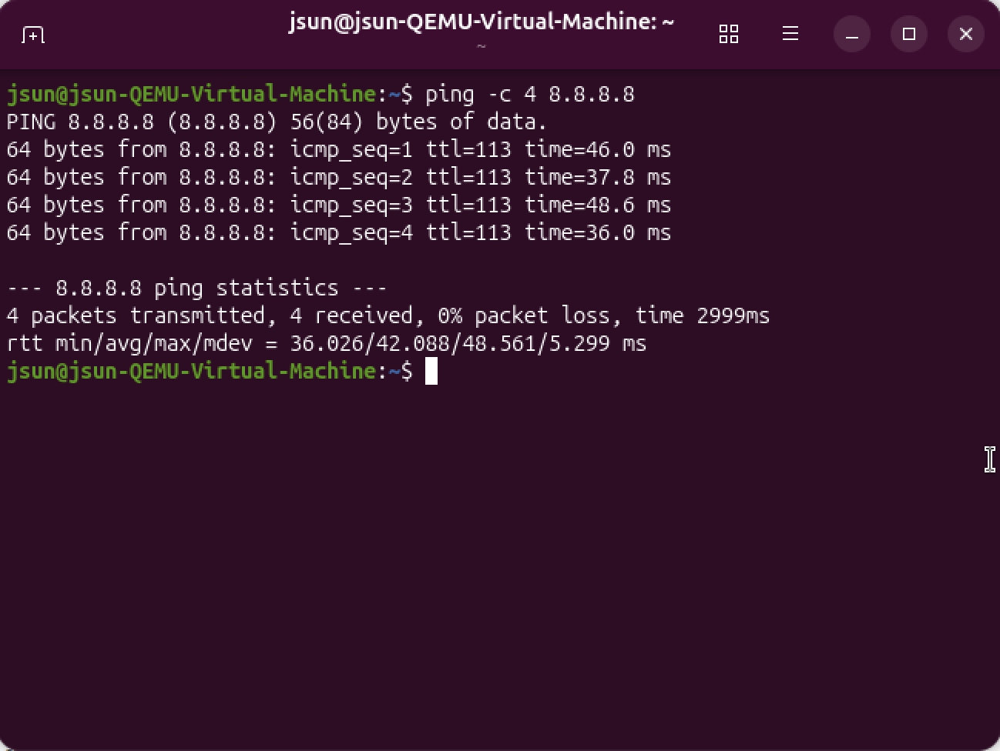
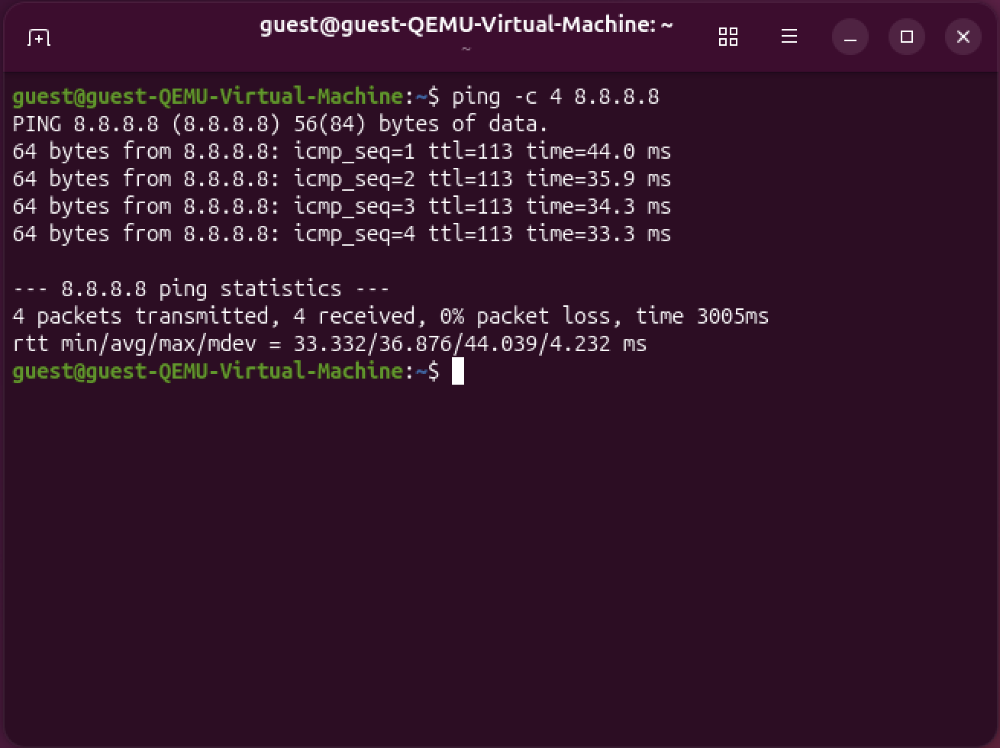

## Firewall Rules

In this part of the project, I set up the firewall rules for OPNsense.
The goal is to make sure that the LAN network has full access to the internet, while the GUEST network is more restricted and cannot reach the LAN.

Here is what I want to achieve:

  - LAN clients should have full internet access
  - GUEST clients should only have internet access
  - LAN and GUEST must not reach each other
  - Basic services like DNS and ICMP should work so testing is easier

All rules are created in:

  Firewall → Rules

## 1. Default Behavior OPNsense

OPNsense starts with a few default rules:

  - LAN allows everything
  - OPT1 (GUEST) blocks everything
  - WAN blocks private networks

These defaults are a good start, but I need to adjust them so the networks behave the way I planned.

## 2. LAN Rules (LAN → em1)

Navigate to:

  Firewall → Rules → LAN

Configure the following rules:

### 1. Allow LAN to Any (Default)

OPNsense already includes this rule.
It gives the LAN network full access to the internet, the firewall itself, and also the GUEST network.

I keep this rule, but I add a block rule above it so LAN cannot reach the GUEST network.

### 2. Block LAN → GUEST Network

I added the following rule:
  
  - Action: Block
  - Interface: LAN
  - Source: LAN net
  - Destination: 192.168.20.0/24
  - Description: Block LAN access to GUEST

This rule must be moved above the default “Allow LAN to any” rule.
This way, LAN machines cannot reach the GUEST network.

## 3. GUEST Rules (OPT1 → vtnet2)

To configure the GUEST network, I went to:
  
  Firewall → Rules → OPT1

By default, OPNsense blocks everything here.
Next, I added the rules that GUEST needs.

### 1. Allow GUEST → Internet (NAT)

This rule allows GUEST clients to reach the internet:

  - Action: Pass
  - Interface: OPT1
  - Source: OPT1 net
  - Destination: any
  - Description: Allow internet access for GUEST

Outbound NAT will automatically translate the traffic to the WAN IP.

### 2. Block GUEST → LAN

This rule blocks any access from GUEST into the LAN network:
  
  - Action: Block
  - Source: OPT1 net
  - Destination: 192.168.10.0/24
  - Description: Block access to LAN

This protects the LAN from any guest device.

Place this rule above the allow-internet rule to keep it clear and readable.

### 3. Allow DNS for GUEST

If GUEST clients should be able to resolve domains, they need DNS:

  - Action: Pass
  - Interface: OPT1
  - Protocol: TCP/UDP
  - Source: OPT1 net
  - Destination: OPT1 address
  - Port: 53
  - Description: DNS for GUEST clients

### 4. Allow ICMP (Optional for Testing)

To make testing easier, I optionally added:
  
  - Protocol: ICMP
  - Destination: any
  - Description: Allow ping for diagnostics

This helps when checking reachability.

## 4. Summary of Rule Order

Correct rule order is important because OPNsense evaluates rules from top to bottom.

### LAN (vtnet1)
  
  1. Block LAN → GUEST

### GUEST (OPT1 / vtnet2)

  1. Allow DHCP
  2. Block GUEST → LAN
  3. Allow DNS
  4. Allow ICMP (optional)
  5. Allow GUEST → any (internet)

## 5. Testing the Rules

After setting up the rules, I tested both client VMs.

### From the LAN VM

  - Can access https://192.168.10.1
  - Can access the internet
  - Cannot reach any IP in the GUEST network

### From the GUEST VM

  - Can access the internet
  - Cannot reach LAN Network
  - Cannot reach the LAN VM or the firewall LAN address
  - DNS should work once DCHP/DNS are configured
  - Ping works only if ICMP rule is added

### Ping tests

LAN to GUEST:

    ping 192.168.20.1

GUEST to LAN:

    ping 192.168.10.1

Both VMs:

    ping 8.8.8.8 

  LAN VM

  GUEST VM

## 6. Next Steps

With all firewall rules in place, the next step is to configure:
  
  - DHCP for LAN and GUEST
  - DNS services
  - Final connectivity tests

This will be covered in the next document.

